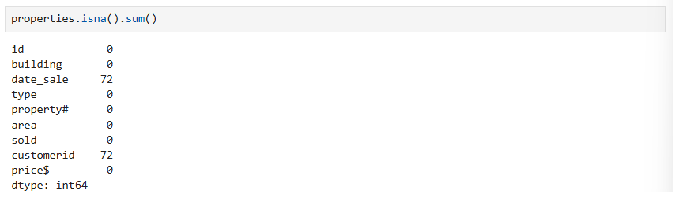
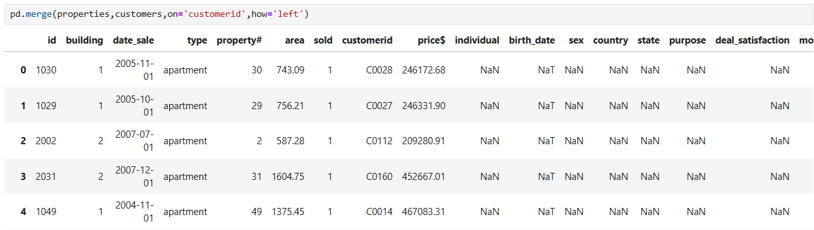
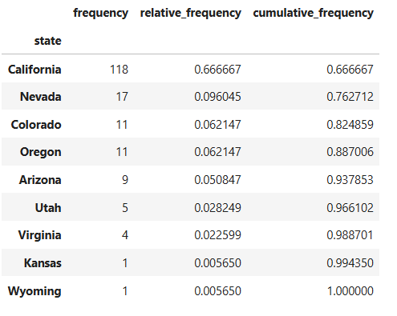
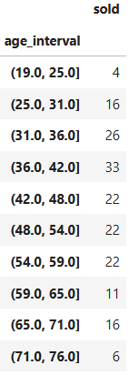

# Real-Estate-Market-Analysis
**Investigating Property transactions and Customer satisfaction**

The real estate market is a complex and dynamic entity of great intrest for professionals in the field, investors, policymakers, and data analysts that wish to thorougly undersand the market conditions and customer behaviour and make informed decisions. In our Real Estate Market Analysis with Python project, the client-a leading company in the industry-has collected data on properties and their customers and wishes to gain indights with real estate analysis

## Table of Contents
- [Project Objective](#Project-Objective)
- [Data Preprocessing](#Data-Preprocessing)
  - [Data Cleaning and Preprocessing (Properties Dataset)](#Data-Cleaning-and-Preprocessing-(Properties Dataset))
  - [Data Cleaning and Preprocessing (Customers Dataset)](#Data-Cleaning-and-Preprocessing-(Customers Dataset))
  - [Combining the Two Datasets](#Combining-the-Two-Datasets)
- [Descriptive Statistics](#Descriptive-Statistics)
- [Data Analysis](#Data-Analysis)
- [Data Visualization](#Data-Visualization)
- [Data Interpretation](#Data-Interpretation)


## Project Objective
This project aims to preprocess, analyze, and visualize the real estate property data, therby generating meaningful insights about property transactions and customer profiles

## Data Preprocessing
1. Import all the relevant libraries
2. Read the data
3. Data Cleaning
4. Combining two datasets

### Data Cleaning and Preprocessing (Properties Dataset)
- **Create a Copy of the Original Dataset**
  
  Creating a new variable that replicates the original data acts as a natural 'checkpoint' in our data processing. This ensures that we always have access to pristine data if we need to revert our changes indicating that it holds a safeguard copy of the original data
  ```python
     properties = prop_df.copy()
  ```

- **Casting `id` column to string**
  
  IDs are often arbitrary identifiers, not numerical values meant for calculations. Treating IDs as strings allows us to perform categorical operations like grouping data by ID, counting unique IDs,etc. Converting ID columns to strings ensures that they are treated as labels rather than numerical values.
  
- **Resolving the col_name issue**
  
  When we try to convert `id` column to string we encounter an error. (Pandas doesn't recognize it as a valid column name). Upon investigating we found an encoding issue with an unnecessary byte order mark(BOM) attached to the column name. The solution for this is, we rename the column, effectively discarding the irrelevant metadata

  <p align='center'>
    
  </p>

  ```python
  properties.rename(columns={'\ufeffid':'id'},inplace=True)
  properties['id'] = properties['id'].astype('str')
  properties['id']
  ```
  
- **Changing the dtype of `building` and `property#` columns**
- **Dealing with `date_sale` column**
  - First, deal with `#NUM!` (i.e., replace them with pandas NA)
  - Then convert its datatype to datetime
  
- **Change the case of the `type` column to lowercase for consistency**
  
- **Dealing with `Price` column**
  - The reason for price variable to be string is `$`
  - First we'll strip the `$`
  - Then get rid of `,`
  - Fianlly change the dtype to float
    
- **Mapping values in `status` column to 1's and 0's**
  - First look at the unique values and if there are any inconsistencies deal with them first. In our case we need to trim the values as there is a leading space
  - Then rename the column to `sold`
  - Finally map values to 1's and 0's
  
- **Checking for missing values and Dealing with them if necessary**
  <p align='center'>
    
  </p>

  Here we can see that `cusotmerid` and `date_sale` columns have 72 Na values. But we don't have to deal with them and leave them as they are they indicate that purchase is not done(unsold). So we don't have to change them
  
### Data Cleaning and Preprocessing (Customers Dataset)
- **Create a Copy of the Original Dataset**
  ```python
  customers = cust_df.copy()
  ```
  
- **Inspecting column names and dealing with them if necessary**
  <p align='center'>
    
  </p>
  
- **Renaming the entity column and mapping values to 1's and 0's**
  - First, rename column name to `individual`
  - Then map values to 1's and 0's
  
- **Mapping `Gender`, `mortgage` values to 1's and 0's**
  
- **Changing the case of `purpose` and `source` columns to lower-case**
  
- **Creating a full_name column by combining name and surname**
  - First, combine `name` and `surname` columns and create a new column named `full_name`
  - Then drop the `name` and `surname` columns

  ```python
  customers['full_name'] = customers['name'] + " " + customers['surname']
  customers.drop(['name','surname'],axis=1,inplace=True)
  ```
  
- **Changing the dtype of `birth_date` column**

We are done with Cleaning and Preprocessing both of our tables. We can move forward and combine our datasets.

### Combining the Two Datasets
1. **Preliminary checks**
   
   Initial step is to visually inspect the top five rows of each dataset. Specifically, `customer_ID` feature in both tables as we are going to merge these two datasets on 'customerid` column
   
2. **Mergeing 2 tables**
  <p align='center'>
    
  </p>

We can see that the merge did not work as intended. The problem might be with the key, let's look into it
   
3. **Identifying and Resolving merge issues**
   <p>
     
   </p>

   - It's apparent that the two datasets differ - there are unexpected and unnecessary spaces
   - Let's trim the unncessary white space from `customerid` in the properties dataframe
   
4. **Final checks and merge**
   <p align='center'>
     
   </p>

   Now, we can see that the merge is performed as intended
   
5. **Handling missing values**

   `real_estate_data` is the dataset we got after merging two datasets `properties` and `customers`
   
   ```python
   real_estate_data.fillna(pd.NA)
   ```
   
7. **Creating a Checkpoint**
   - It is better to create a checkpoint after cleaning and preprocessing our data
   - We'll assign the cleaned and preprocessed data to a new variable 'data'.


## Descriptive Statistics
<p align='center'>
  
</p>

#### Breakdown by Building

We observe that the `building` column has five unique values

- Breakdown of totals by building (frequency distribution by building)
  - Storing columns of intrest in a list
  - Then grouping data
  - We group the data for all cases in similar manner just with few changes(i.e., columns of intrest and the operation we want to perform)

  <p>
    
  </p>
  
- Breakdown of averages by building
  <p>
    
  </p>
  
#### Breakdown by Country
- Breakdown of totals by Country (frequency distribution by Country)
  
  Here there is a small issue we need to address before grouping data(i.e., We have 2 USA values one has a leading empty space in it which we need to deal with it 
 first)
  <p>
    
  </p>
  
- Breakdown of averages by Country
  <p>
    
  </p>
  
#### Breakdown by State
- Frequency distribution by State
- Relative frequency by State
- Cumulative frequency by State

  <p>
    
  </p>
  
## Data Analysis
#### Analyzing customers age
- Age of our buyers at the time of purchase
- Subtracting the `birth_date` from `date_sale` and store it in new variable called `age_at_purchase`
- The `age_at_purchase` field we've just created is of timedelta datatype.
- For our analysis, we need the age in integers or floats for better manipulation
- and divide every value in `age_at_purchase` by 365 to get customer age and round every element using `np.floor()` function
- To divide age into different intervals, we can use `cut` method
```python
data['age_interval'] = pd.cut(data['age_at_purchase'],bins=10,precision=0)
```
- and group data by `age_interval`

<p align='center'>
  
</p>
 
#### Analysis of the price of properties
- Similar to the analysis of the age variable, we create price intervals. For convenience, we use 10 bins
```python
data['price_interval'] = pd.cut(data['price$'],bins=10)
```
- Then we find the number of properties within each price interval
- Next, we see the number of sold properties per price interval
- also, check the number of unsold properties

<p align='center'>
  
</p>

#### Relationship between age and price

To analyze the relationship between customer age and property prices, we first filter the dataset to include only sold properties, ensuring that the analysis focuses on relevant data
- Then calculate the covariance between age and price using the NumPy `.cov()` function
- Covariance doesn't provide an intuitively understandable value, so we also calculate `np.corrcoef(col_1,col_2)` or `data[[col_1,col_2]].corr()`

<p align='center'>
  
</p>


## Data Visualization

Having done all the necessary data preparation and statistical analysis, we will now create the required visualizations to furthur understand and analyze the data

#### 1. Deal satisfaction by Country (Bar Chart)

To plot the deal satisfaction by country, we need data showing a breakdown of deal satisfaction by country.

<p align='center'>
  
</p>

#### 2. Age Distribution (Histogram)

To plot the age distribution, we need the age variable we created

<p align='center'>
  
</p>

#### 3. Segmentation by State (Pareto Chart)

For this visualization, we should display the relative and cumulative frequency of sold properties by state

<p align='center'>
  
</p>

#### 4. Total sales per year (Line Chart)

Revenue in Million
<p align='center'>
  
</p>

#### 5. Yearly sales distribution across buildings (Stacked Area Chart)

To plot the total number of sales per year and building, we must 
1. Initialize a checkpoint dataframe
2. Formulate building indicators
3. Redefine column names
4. Exclude unsold properties
5. Generate a yearly breakdown
6. Create stacked area chart

<p align='center'>
  
</p>

## Data Interpretation 

After preprocessing, analyzing, and visualizing data. We can draw following conclusions/insights

### 1. Customer Profile

Customer profile allow real estate owners and developers to look for the perfect buyers
<p align='center'>
  
</p>

- We can note that the age which most customers purchase a home is between 31 and 42 - more precisely, the 36-42 bracket, closely foloowed by 31 to 26
- Now, the real estate firm can create an ideal buyer profile to discover customers whose characteristics align with those of their ideal persona. They can then target the specific cluster of people through ads on YouTube, Google, Facebook, or similar marketplaces.

### 2. Building Characteristics 
#### **Breakdown by Building**
  
  Based on our analysis, we conclude that the most sold buildings are types 2 and 3
  <p>
    
  </p>
  
  However, when we examine the average price and deal satisfaction, we motice something else
  <p>
    
  </p>
  
  - Type 4 has the highest average property sale prices at 290,000USD. Types 2 and 3 are close behind. Going back to the buildings in type 4, we see that the average deal satisfaction is also highest-close to 3.9
  - Type 4 is also the highest in terms of area
  - It is likely that the buildings in type 4 have more luxurious or spacious apartments. The totals show that these kinds of properties don’t sell as often as others. They are also more expensive due to their size, as buildings are sold per square meter. Customers are more likely to buy smaller and less expensive building types, as indicated by the trends in our dataset.Real estate developers can consider this information when devising their strategies. One option is to rely on more standard building types, such as 2 and 3, and sell more buildings at a more average price. Alternatively, they can invest in a few more luxurious apartments and sell them at a higher price, thus creating a higher deal satisfaction.
    
#### **Sales by Country**

  Looking at the geographical data, we notice that 90% of the sales come from the United States

  <p>
    
  </p>
  
#### **Total Number of Sales per Year by Building**

  We observe that 2007 is by far the most popular year for sales. Based on historical events, this comes as no surprise as it happened right before the market crash in the States

  <p align='center'>
    
  </p>
